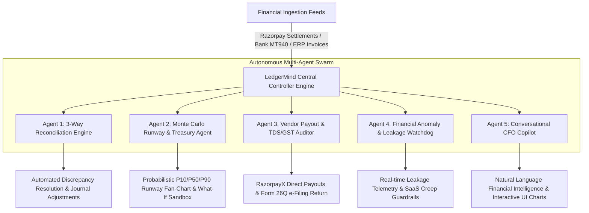

# ⚡ Razorpay LedgerMind AI — Autonomous Finance Controller & Treasury Copilot
> **Track 4: AI Finance Controller** | Razorpay Internship & Engineering Challenge 2026

[](https://github.com/razorpay)
[](https://razorpay.com)
[](https://razorpay.com/x/)
[](https://incometax.gov.in)

---

## 📌 Executive Summary
Modern fast-growing companies and CFOs lose millions to fragmented financial operations, delayed 3-way reconciliations between payment gateways and bank accounts, opaque cash runways, and tax compliance overheads.

**Razorpay LedgerMind AI** is an enterprise-grade **Autonomous Financial Controller & Treasury Copilot** designed natively for the **Razorpay Gateway** and **RazorpayX** banking ecosystem. It operates 24/7 as an autonomous multi-agent swarm to eliminate financial leakage, automate double-entry balancing, forecast runways with Monte Carlo simulations, and ensure 100% statutory TDS & GST compliance.

---

## 🏛️ System Architecture



---

## ✨ Core Innovations & Features

### 1. ⚖️ Autonomous 3-Way Reconciliation Studio (Flagship)
- **3-Way Split Ledger**: Cross-references **Razorpay Gateway Gross Settlements** $\leftrightarrow$ **Bank Statement Credits (ICICI/HDFC)** $\leftrightarrow$ **ERP Ledger Invoices (Tally/Zoho/QuickBooks)**.
- **5 Discrepancy Classifiers**:
  - **MDR Fee Contract Drift**: Detects unauthorized MDR tier charges (e.g. 3.0% applied on corporate cards instead of 1.85% SLA).
  - **Settlement Timing Float (T+2 Drift)**: Tracks weekend cut-offs and holiday settlement windows.
  - **Unrecorded Refunds**: Identifies gateway-level customer refunds omitted from ERP books.
  - **Ghost / Orphan Captures**: Flags bank credits where checkout webhooks failed to generate an internal order.
  - **Missing Bank Credits**: Unsettled captured payments.
- **1-Click Auto-Balancing**: Synthesizes double-entry debit/credit journal adjustments and auto-generates Razorpay dispute packets.
- **Statutory Audit Certificate**: Export official audit reports in CSV and printable certificate format.

### 2. 📈 Stochastic Monte Carlo Runway & Treasury Simulator
- **1,000-Path Probabilistic Simulation**: Geometric Brownian Motion modeling revenue volatility, net burn, and funding horizons.
- **Confidence Bands**: Generates $P_{10}$ (Stress Case), $P_{50}$ (Expected Median), and $P_{90}$ (Bull Case) cash trajectories over 24 months.
- **Interactive "What-If" Scenario Builder**:
  - 👥 **Headcount Delta**: Live CTC impact modeling ($\pm N$ hires).
  - 📈 **Revenue Growth Rate**: Monthly velocity adjustments ($-10\%$ to $+25\%$).
  - ☁️ **Cloud Spend Cuts**: AWS/GCP optimization levers ($0\%$ to $40\%$).
  - 💰 **Fundraising Round Injection**: Simulated Seed/Series A capital infusions.
- **Dynamic Runway Scorecards**: Real-time zero-cash exhaustion date projections.

### 3. 🧾 RazorpayX Vendor Payout & Tax Compliance Hub
- **Indian Income Tax Act Automation**:
  - **Section 194C**: Contractors & Logistics @ 1% (Individuals) / 2% (Companies) with ₹1L aggregate threshold tracking.
  - **Section 194J(a)**: Technical & Cloud SaaS Services @ 2%.
  - **Section 194J(b)**: Professional Legal & Audit Services @ 10%.
  - **Section 194Q**: Purchase of goods exceeding ₹50L @ 0.1%.
- **RazorpayX Penny-Drop Verification**: Validates beneficiary bank account name against registered PAN before payout.
- **1-Click Batch Payout Execution**: Simulated direct escrow disbursements with instant UTR generation and confetti feedback.
- **Form 26Q e-Filing Generator**: Compiles quarterly TDS returns ready for TRACES upload.

### 4. 💬 Conversational CFO Copilot (Autonomous Financial LLM)
- Natural language conversational assistant powered by multi-turn tool calling.
- Step-by-step agent reasoning logs with confidence scoring.
- Embedded interactive visualizations (Bar charts, Donut charts, KPI tables, and direct action triggers).
- Handles complex questions:
  - *"Why did our cloud hosting bill spike 28% this month?"*
  - *"What is our cash runway if sales contract by 15%?"*
  - *"Generate the TDS deduction breakdown for Q2."*

### 5. 🚨 Anomaly Watchdog & Budget Guardrails
- Continuous 24/7 background telemetry.
- Flags **SaaS subscription seat creep** (unassigned Figma/Datadog licenses), **MDR fee leakage**, and **tax threshold breaches**.

### 6. 🎮 Evaluator Showcase / Scenario Injector Panel
- Dedicated judge controls to test the AI controller under live edge cases:
  - ⚡ *Inject ₹42,500 MDR Fee Overcharge*
  - ⚡ *Simulate AWS Cloud Burn Spike (+₹4.5L/mo)*
  - ⚡ *Upload Malicious Duplicate Vendor Invoice with Fake GSTIN*
  - ⚡ *Trigger Weekend Settlement Float (T+2)*
  - ⚡ *1-Click Reset to Clean Benchmark State*

---

## 🛠️ Tech Stack & Implementation Details
- **Frontend Framework**: React 19 + TypeScript + Vite + Tailwind CSS (Razorpay Blade-inspired dark theme).
- **Icons & Animation**: `lucide-react`, `canvas-confetti`.
- **Financial Visualization**: `recharts` for composed multi-axis cash flow charts, Monte Carlo fan-charts, and expense distribution.
- **Financial & Tax Algorithms**:
  - Exact & Fuzzy 3-way matching algorithms.
  - Indian GSTIN 15-digit syntax & state code validation engine.
  - Indian Income Tax TDS (194C, 194J, 194Q) computation engine.
  - Box-Muller transform stochastic Monte Carlo engine (1,000 iterations).

---

## 🚀 How to Run the Project Locally

### 1. Install Dependencies
```bash
npm install
# or on Windows PowerShell:
npm.cmd install
```

### 2. Run Engine Verification Tests
```bash
npx tsx scripts/verify_engines.ts
# or on Windows:
npx.cmd tsx scripts/verify_engines.ts
```

### 3. Start the Development Server
```bash
npm run dev
# or on Windows:
npm.cmd run dev
```
Open `http://localhost:5173` in your browser.

### 4. Build for Production
```bash
npm run build
# or on Windows:
npm.cmd run build
```

---

## 🎯 Evaluator Demo Script (2-Minute Walkthrough)
1. **Dashboard Overview**: Review real-time cash balance, burn rate, and runway gauge.
2. **3-Way Reconciliation Studio**: Click **"Run Agentic 3-Way Match"** to view live streaming agent reasoning traces and click **"Auto-Post Journal Entries"** to resolve discrepancies.
3. **Runway & Treasury Simulator**: Drag the **Hiring Headcount** and **Revenue Growth** sliders to see immediate Monte Carlo probabilistic fan-chart updates.
4. **Vendor & Tax Hub**: Click **"Add Invoice"** to see automatic Section 194J/194C calculation, then click **"Execute Batch Payout"** for simulated RazorpayX execution with confetti!
5. **CFO Copilot AI**: Click suggested prompt chips like *"What is our projected cash runway under 15% stress?"* to see multi-step agent reasoning and embedded responsive charts.
6. **Evaluator Sandbox**: Click **"Demo Controls"** in the top bar to inject edge-case anomalies and watch the AI controller intercept them.

---

**Developed for the Razorpay Internship Challenge 2026 — Track 4: AI Finance Controller.**
